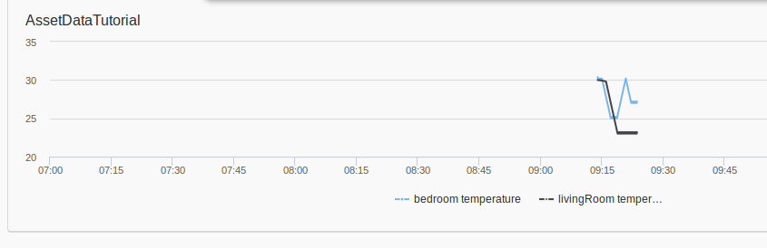

Legato-AirVantage : Asset Data feature
======================================

This sample Legato application demonstrates data exchange feature between an embedded Legato application and AirVantage server, over the LWM2M protocol using Observe feature. This latter feature requires Legato 16.04. Simulated room teperatures are pushed to AirVantage every 5 seconds.

This application has been tested on Sierra Wireless AirPrime WP8548 module hosted on MangOH board. 

Asset Data
----------
Let’s design a simple home automation scenario to monitor and to control temperature of a Room, remotely using AirVantage. 
A room has :
* __3 variables__ : *Name*, *Temperature*, *IsAC_on*. AirVantage only has read-access to these variables
* __1 setting__ : *TargetTemperature* that can be changed by AirVantage. User can therefore set the temperature of the room remotely
* __1 command__ : *TurnOffAC* that can be trigerred by AirVantage upon user request.

This collecttion of data fields are declared as *assets* and named *Room*. Refer to *Component.cdef* file. 

 
Application Scenario
--------------------
This sample application creates 2 __instances__ of Room Asset model to monitor 2 rooms : bedroom and living-room. 
AirVantage can do the following actions, for each instance:
* Retrieve the name of the room, the current temperature and the current status of the AC (On or Off)
* Set the target_temperature of the room, the AC is automatically switched On
* Trigger an command to turn off the AC 

Build
-----
To build executable for WP8549:
~~~
make wp85
~~~

Install the app on target (MangOH/WP8548)
-----------------------------------------
~~~
instapp assetDataTutorial.wp85.update <IP address of target>
~~~

Create an update package & Generate package for upload to AirVantage
--------------------------------------------------------------------
Do the following only Once:
~~~
av-pack -f assetDataTutorial.update <TypeName>
	where <TypeName> shall be globally unique (e.g. AssetDataTutorialApp). AirVantage uses it to uniquely identify multiple versions of this application
~~~

The above commands will create a zip file containing an *update package* and a *manifest xml file*. This latter is used by AirVantage to gain knowledge on the asset data fields to be exchanged with the Legato application. 
Refer to section *Upload Application package to AirVantage* in this [tutorial](https://doc.airvantage.net/av/howto/hardware/samples/legato-asset-data/) to upload the zip file

Start the app on target (MangOH/WP8548)
-----------------------------------------
ssh to target then launch the app as follow:
~~~
app start assetDataTutorial
~~~

Testing
-------
Temperature data history can be plotted on AirVantage portal (Monitoring/DataHistory):

- As the starting point, AC switches are OFF, Room temperatures are therefore high
- Setting targetTemperature on AirVantage will turn ON the AC, temperatures drop toward the regulated temperature
- TurnOffAC command is ent from AirVantage, temperature of the bedroom start climbing
- A new targetTemperature is then set for the bedroom

Refer to Step3 (Data Exchange) in this [tutorial](https://doc.airvantage.net/av/howto/hardware/samples/legato-asset-data/) to test the Application scenario
